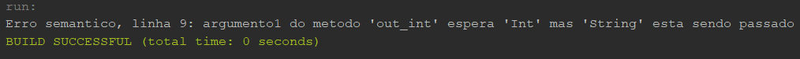

# Compilador Cool
 Um compilador implementado em Java para compilar programas da linguagem Cool.

## Léxico

### In:                                     

### Out:  

## Sintático

### In:                                     

### Out:  

## Semântico

### In:                                     

### Out:  

 
